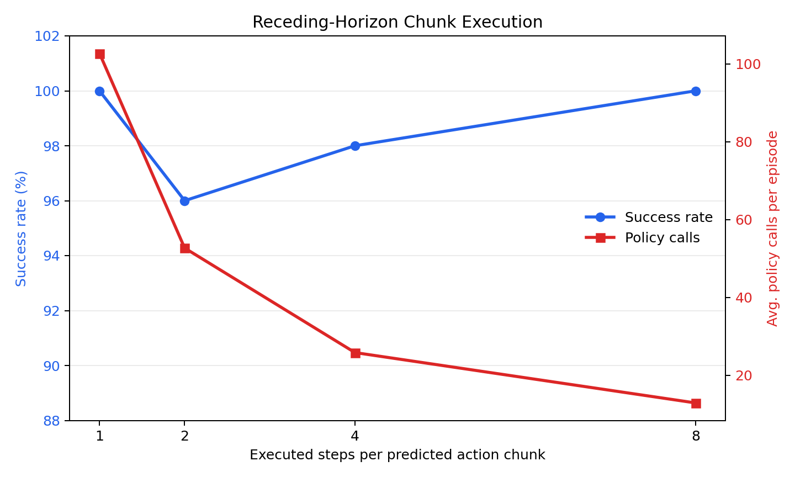
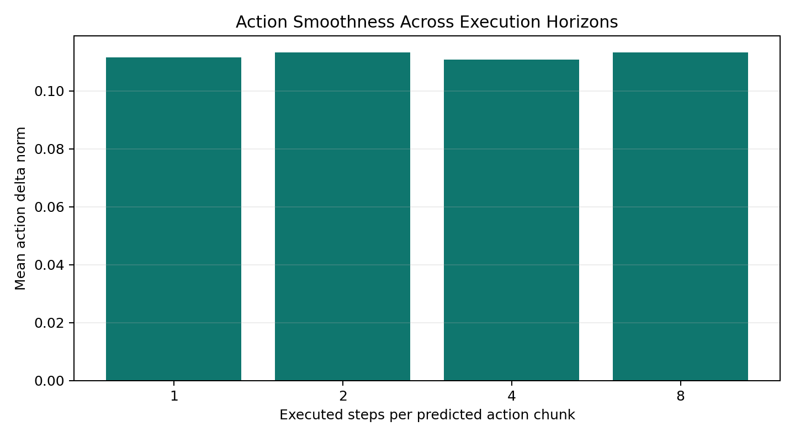
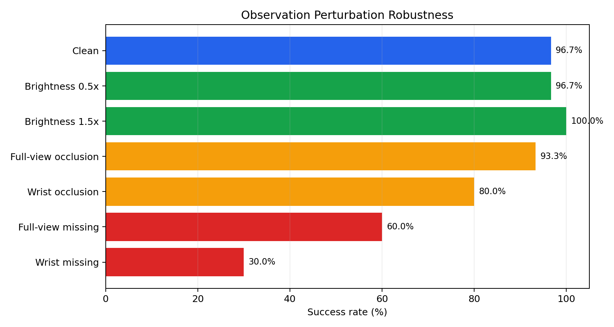
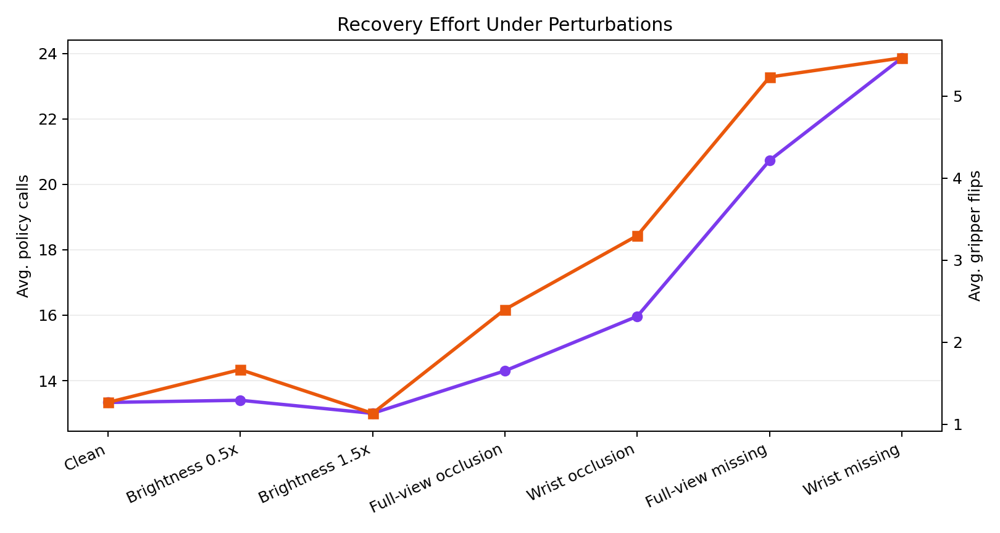

# Result Gallery

This folder contains a lightweight, GitHub-ready summary of the local evaluation outputs.
Large checkpoints and raw simulation environments are intentionally excluded.
Unified conclusion: action chunking improves execution efficiency, while larger executed horizons weaken closed-loop correction; visual perturbations, especially missing-view conditions, amplify that weakness.

## LIBERO Receding-Horizon Evaluation

The policy predicts a multi-step action chunk. During evaluation, only the first `k` steps are executed before re-observing and re-planning.



| k | Success | Env Steps | Policy Calls | Smoothness | Gripper Flips |
| --- | --- | --- | --- | --- | --- |
| 1 | 100.0% | 101.7 | 102.7 | 0.112 | 1.46 |
| 2 | 96.0% | 104.0 | 52.7 | 0.113 | 1.36 |
| 4 | 98.0% | 100.8 | 25.8 | 0.111 | 1.28 |
| 8 | 100.0% | 98.0 | 12.9 | 0.113 | 1.26 |



Key Insight: larger chunks reduce policy calls sharply, but the improvement in efficiency comes with weaker closed-loop correction. The best horizon is not the largest one; it is the one that balances responsiveness and policy-call cost.

## Observation Perturbation Benchmark

Perturbations are applied to the policy observation stream to test whether multi-view VLA execution remains stable under missing views, random occlusion, and brightness shift.



| Case | Success | Failures | Env Steps | Policy Calls | Smoothness | Gripper Flips | Frequent Failed Task IDs |
| --- | --- | --- | --- | --- | --- | --- | --- |
| Clean | 96.7% | 1 | 102.1 | 13.3 | 0.112 | 1.27 | 2x1 |
| Brightness 0.5x | 96.7% | 1 | 102.4 | 13.4 | 0.116 | 1.67 | 2x1 |
| Brightness 1.5x | 100.0% | 0 | 99.2 | 13.0 | 0.110 | 1.13 |  |
| Full-view occlusion | 93.3% | 2 | 109.5 | 14.3 | 0.124 | 2.40 | 4x1, 9x1 |
| Wrist occlusion | 80.0% | 6 | 123.5 | 16.0 | 0.129 | 3.30 | 0x1, 2x1, 4x1 |
| Full-view missing | 60.0% | 12 | 161.5 | 20.7 | 0.140 | 5.23 | 4x3, 7x3, 1x2 |
| Wrist missing | 30.0% | 21 | 187.2 | 23.9 | 0.138 | 5.47 | 0x3, 3x3, 5x3 |



Key Insight: visual perturbations hurt stability much more than brightness changes. Missing-view conditions are the main failure mode, with wrist-view removal causing the steepest drop in success and the largest increase in recovery cost.

## Files

- `horizon_sweep_summary.csv`: source metrics for execution horizon comparison.
- `perturbation_sweep_summary.csv`: source metrics for robustness comparison.
- `assets/*.png`: rendered figures for README or slides.
- `assets/*.mp4`: short qualitative rollouts small enough for GitHub review.

Regenerate this folder with:

```bash
python scripts/eval_scripts/build_result_gallery.py
```
